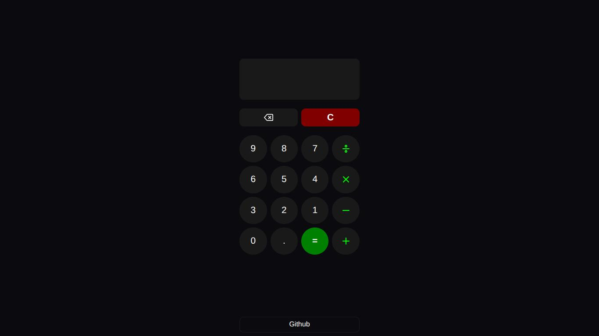

# Calculator

This project is part of the Foundation course part of [The Odin Project](https://www.theodinproject.com). Although making the app responsive was not required at this level, i try to make it responsive and accessible. i used `custom property`, `relative units`, and `css functions (like calc())` to ensure the layout adapts different screen sizes and respects the user's browser font-size settings.

[**View in Demo**](https://saleamlakh.github.io/calculator/)

## Features
- **Basic Math**: Handles addition, subtraction, multiplication, and division.
- **Decimal number**: support decimal number inputs
- **Delete and Clear**: 
- **Keyboard Support**:
    - `Number keys`: Input digits
    - `backspace` : Delete last digit
    - `+`, `-`, `*`, `/` : Operators
    - `=`: Calculate result

## Project Notes
- **Transform elements**: translating or scaling reduces the clickable area.

- **event.preventDefault()**: when you use this method make sure it doesn't affect the browser shortcuts. Try not to prevent the user from using browser shortcuts.

## Credits
I get the icons from [Feathersicons.com](https://feathericons.com/)

The design was inspired by the samsung calculator design. 